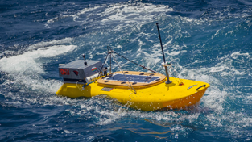
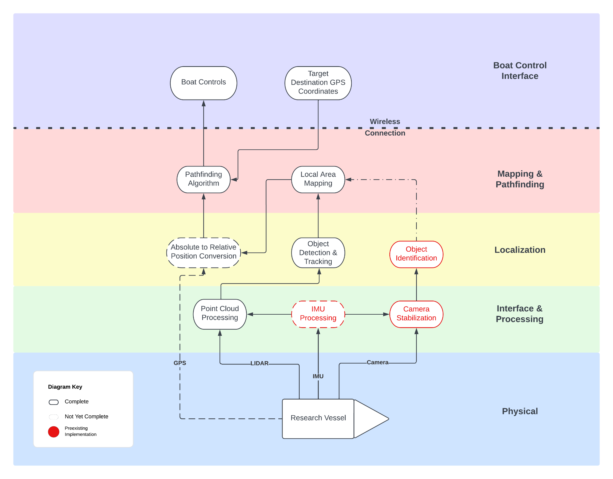

# AVVS: Autonomous Vessel Vision System



The Autonomous Vessel Vision System (AVVS) is designed to take a pre-existing oceanic research vessel owned by the Oregon State University College of Earth, Ocean, and Atmospheric Sciences and make it autonomous. The vessel is for studying the interactions of salt-fresh water interfaces, often in areas with irregular magnetic fields making standard radio control systems difficult to operate. So the AVVS needs to be able to identify and navigate around glaciers, other boats, and contend with currents and winds without constant communication with the researchers overseeing it. The goal of this system is to have full pathfinding and navigation based on environmental input.

## Our Work

The 2022 OSU capstone group has extendend the functionality of camera-based object detection done by a 2020 capstone group. The 2022 group added support for a LIDAR sensor and improved local mapping capabilities to enable the implementation of a robust pathfinding algorithm. To help with testing and simulation, the 2022 group is using Robot Operating System 2 (ROS2), a professional open source toolchain, to do simulation and development. Our work has included adapting code from the original 2020 capstone group, porting & refactoring packages from outdated ROS versions, developing new code for simulation, boat localization, and pathfinding.



Module in the above diagram roughly correspond to subfolders in the GitHub repo:
```
[branch]/path/to/submodule                       :  features

[master]/articubot_one                           :  Local Area Mapping, Absolute to Relative Position Conversion
[lidar]/src/lidar_transform                      :  Point Cloud Processing
[lidar]/src/slidar_ros2                          :  Physical LIDAR data read
[lidar]/src/multiple_object_tracking_lidar_ros2  :  Object Detection & Tracking
[lidar]/src/lidar_faker                          :  LIDAR data simulator
```

In the current build, there are systems for detecting objects with LIDAR, cameras, as well as mapping and pathfinding. The sensor systems are not yet integrated with the mapping and pathfinding, and the pathfinding is still using ROS2's basic parameters. All systems need and to be fine-tuned before real usage.

Future work includes:
```
	-Improved navigation
	-Total system integration of all modules	
	-Improved documentation
	-Real world testing of the system
```

## Why LIDAR, ROS2, and this project?

While the previous capstone group managed to develop an object classification system, it only provided the angle of the identified objects with no information on the distance to the object. This system does not provide enough information to run an autonomous research vessel in real-world scenarios. LIDAR supplements the existing system by telling us exactly where objects are relative to the vessel. This data is combined with the previous group's computer vision data to tell us what objects  actually are (boat, iceberg, ect).

ROS2 provides a unifying framework for autonomous vehicle development which allows for rapid prototyping and iteration. Further, it is integrated with Gazebo, a high quality simulation environment. This allows early and consistent testing of our system without costly and time consuming trips. 

To the authors' best knowledge, there are no currently existing autonomous naval vessels. This system has been custom designed to meet the needs of OSU's College of Earth, Ocean, and Atmospheric Sciences. Our system enables more reliable study of glaciers and other arctic ocean environments than the existing control system.

## Getting Started & Documentation

1. [Install ROS2 Humble](https://docs.ros.org/en/humble/Installation.html) (LINUX STRONGLY RECOMMENDED).

2. Clone this repo.

3. Install dependencies:

   * `rosdep install --from-path src`

 * If that gives you issues try:

   * `rosdep install --from-paths src --ignore-src -r -y --rosdistro humble`

 * NOTE: you might need to init rosdep first, google it/use ROS2 Humble docs

4. Building

 * `source /opt/ros/humble/local_setup.bash`

 * In the head directory (capstone_boat_23)

 * `colcon build`

 * `source install/setup.bash`

 * NOTE: If you use a different shell (csh, ect) there are different scripts

5. Running

 * LIDAR Object Detection & Simulation (in two terminal/tmux windows):

   * `ros2 launch multiple_object_tracking_lidar multiple_object_tracking_lidar.launch.py`

   * `ros2 run lidar_faker faker`

 * NOTE: To run anything, you need to do both of the source commands first

NOTE: comprehensive documentation is currently under development. Currently, documentation is accessible via code comments. For technical questions, contact the developers (see below).

## Contact Us

For all questions about this project (technical or otherwise), please contact [Dr. Jonathan Nash](mailto:nashj@oregonstate.edu) or [Jasmine Nahorniak](mailto:jasmine.nahorniak@oregonstate.edu). They can direct you to current maintainers of this project or contact the original developers if necessary.

## Authors

- [Parker Carlson](https://www.github.com/thefxperson)
- [Sammy Jazdak](https://www.github.com/SamuelJazdak2)
- [Ethan Cline](https://www.github.com/clineee)


## Acknowledgements

 - [Johnathan Nash](nashj@oregonstate.edu)
 - [Jasmine Nahorniak](jasmine.nahorniak@oregonstate.edu)
